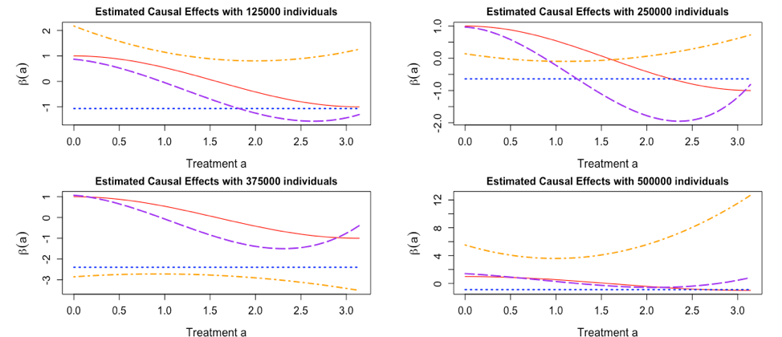
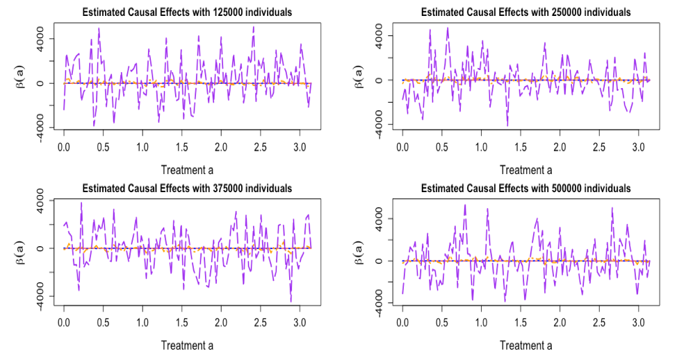
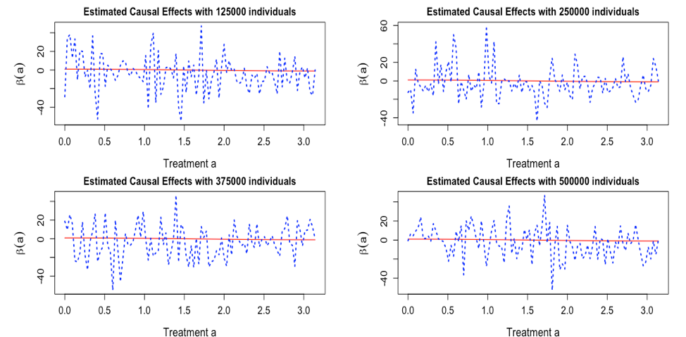
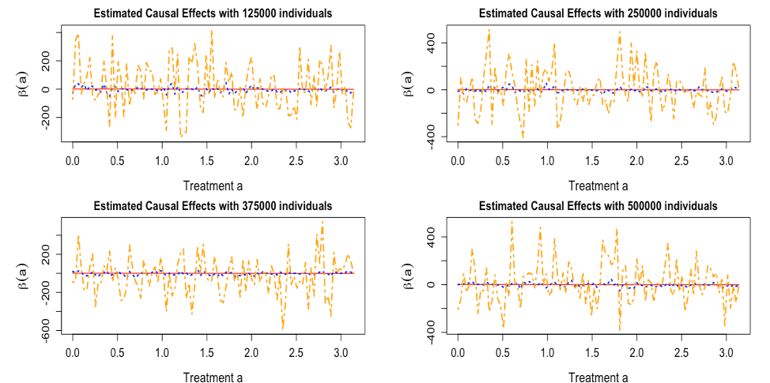

# Random forest kernel: nonparametric predition of kernel causal effects
Hengshi Yu

## Introduction

Causal effects:

1. Counterfactual/potential outcome assumptions:
	- Outcome invariant to the treatment assignment (exchangeability). 
	- Equal to the observed outcome $Y$ under that treatment (consistency). 
	- Could be observed in population (positivity). 

2. Marginal causal effect `E[Y(a = 1)] - E[Y(a = 1)]` via inference on `E(Y | A = 1) - E(Y | A = 0)`. 

Motivation:

1. Treatment on continuous scale, like dose of medicine. 
2. Treatment is a combination, rather than a simple variable
3. Causal effect depends on the treatment values. 

How to estimate the marginal causal effects in longitudinal data under specific continuous treatment value, when the causal effect depends on the treatment value?

## Generalized estimating equations (GEE)

GEE is often used to estimate the marginal causal effects in longitudinal setting. The estimator usually is a contrast of estimated parameters. 

GEE is a semi-parametric method, where it specifies the restricted-mean model and only has a "working" model for the covariance. 

## Random forest
Random forest is one of the most widely-used methods in machine learning. 

	- training based a sequence of decision trees
	- regression trees or classification trees based on the trained random forest model

Random forest does not enforce a "correct" model between input and output, but empirically focus on the accuracy of prediction. 

### Random forest kernel prediction

From random forest, predictions:

	- E(Y | A1 = a1, ..., AK = aK)
	- E(Y | A1 = c1, ..., AK = cK)

Then, causal effect is estimated "estimate":`E(Y | A1 = a1, ..., AK = aK)` -  `E(Y | A1 = c1, ..., bK = cK)`

- estimate causal effects under unknown model via prediction
- is nonparametric from statistical learning techniques
- does not have the asymptotic inferences on the estimator

## Kernel Causal effects

1. GEE:
    `mu(ij) = b0 + b1 Ai` ==>  `b1`
2. GEE complex 1:
    `mu(ij) = b0 + b1  Ai + b2 Ai^2 + b3 Ai^3` ==> `b1 + 2 b2 Ai + 3b3 Ai^2`
3. GEE complex 2: `mu(ij) = b0 + b1  Ai + b2 Ai^2 + b3 Ai^3 + b4 Ai^4` ==> $b1 + + 2 b2 Ai + 3b3 Ai^2 + 4b4Ai^4$
4. Random forest kernel:
    Train `Yi = RF(Ai)`$\\
   - E(Y | Ai = a + 1) - E(Y|Ai = a )
   - 10 x [E(Y | Ai = a + 0.1) - E(Y|Ai = a )]
   - 100 x [E(Y | Ai = a + 0.01) - E(Y|Ai = a )]

## GEE

some *truth* text, 
some *naive* text.
some *Complex 1* text.
some *Complex 2* text.

## RF kernel width 1

## RF kernel width 0.1

## RF kernel width 0.01

## References
* Liang, K. Y., & Zeger, S. L. (1986). Longitudinal data analysis using generalized linear models. Biometrika, 73(1), 13-22.
* Zeger, S. L., & Liang, K. Y. (1986). Longitudinal data analysis for discrete and continuous outcomes. Biometrics, 121-130.
* Breiman, L. (2001). Random forests. Machine learning, 45(1), 5-32.